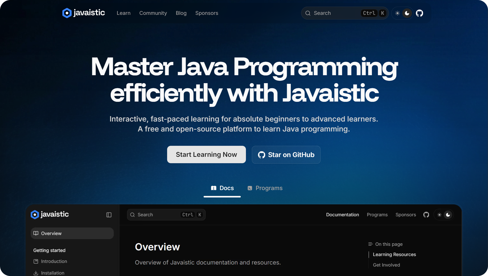

<div align="center">

<br>


<br>
<br>

**A modern, open-source, comprehensive platform for mastering Java programming**

<br>

[](https://github.com/javaistic/javaistic/stargazers)
[](https://github.com/javaistic/javaistic/network/members)
[](LICENSE.md)
[](https://github.com/javaistic/javaistic/issues)
[](https://github.com/javaistic/javaistic/pulls)
[](https://github.com/javaistic/javaistic/actions/workflows/codeql-analysis.yml)
[](https://javaistic.betteruptime.com/?utm_source=status_badge)

### [🌐 Visit Site](https://javaistic.vercel.app/) • [📝 Blog](https://javaistic.vercel.app/blog) • [📋 Changelog](https://javaistic.vercel.app/changelog) • [📊 Status](https://javaistic.vercel.app/status)

<br>

[](https://javaistic.vercel.app/?utm_source=github&utm_medium=readme-image&utm_campaign=javaistic)

## [Explore Javaistic →](https://javaistic.vercel.app/?utm_source=github&utm_medium=readme-link&utm_campaign=javaistic)

</div>

## 🎯 Overview

Javaistic is a modern, open-source learning platform designed to help developers master Java programming from fundamentals to advanced concepts. Built with cutting-edge web technologies, it provides an interactive, distraction-free environment with comprehensive documentation, hands-on programs, and real-world examples.

### Why Javaistic?

- **📚 Comprehensive Curriculum** - Complete Java learning path from basics to advanced topics
- **💻 Hands-On Practice** - A lot of practical programs with detailed explanations
- **🎨 Modern UI/UX** - Beautiful, responsive design with dark/light mode support
- **⚡ Lightning Fast** - Optimized performance powered by Next.js 15 and Turbopack
- **🔍 Smart Search** - Advanced search with intelligent filtering
- **📱 Mobile-Ready** - Seamless experience across all devices
- **🆓 Completely Free** - No ads, no paywalls, just learning
- **♿ Accessible** - Built following WCAG standards

## ✨ Key Features

### 🎓 Learning Resources

#### Documentation

- **Fundamentals** - Variables, data types, operators, control structures
- **OOP Concepts** - Classes, objects, inheritance, polymorphism, encapsulation
- **Advanced Topics** - Generics, collections, streams, lambda expressions
- **Design Patterns** - Creational, structural, and behavioral patterns
- **Database Integration** - JDBC basics and CRUD operations
- **Concurrency** - Multithreading and synchronization
- **Networking** - TCP/UDP socket programming
- **GUI Development** - Swing basics, event handling, layout managers

#### Practical Programs

- Number operations (factorial, Fibonacci, prime numbers)
- Mathematical calculations (compound interest, GCD/LCM)
- Array manipulations and algorithms
- Date and time utilities
- Binary number operations
- And more!

### 🛠️ Technology Stack

| Category            | Technologies                          |
| ------------------- | ------------------------------------- |
| **Framework**       | Next.js 15 (App Router)               |
| **Language**        | TypeScript                            |
| **Styling**         | Tailwind CSS 4.x                      |
| **Content**         | Fumadocs (MDX)                        |
| **Fonts**           | Inter, Funnel Display, JetBrains Mono |
| **Analytics**       | Google Analytics                      |
| **Deployment**      | Vercel                                |
| **Package Manager** | Bun                                   |

## 🚀 Getting Started

### Prerequisites

- [Bun](https://bun.sh/) (recommended) or Node.js 18+
- Git

### Installation

```bash
# Clone the repository
git clone https://github.com/javaistic/javaistic.git

# Navigate to the project directory
cd javaistic

# Install dependencies
bun install

# Start the development server
bun run dev
```

The application will be available at `http://localhost:3000`.

### Available Scripts

```bash
bun run dev          # Start development server with Turbo
bun run build        # Build for production
bun run start        # Start production server
bun run lint         # Run ESLint
bun run format       # Format code with Prettier
```

## 🤝 Contributing

We welcome contributions from the community! Whether you're fixing bugs, adding features, improving documentation, or creating new Java programs, your help makes Javaistic better.

### How to Contribute

1. **Fork the repository**
2. **Create a feature branch** (`git checkout -b feature/amazing-feature`)
3. **Commit your changes** (`git commit -m 'Add amazing feature'`)
4. **Push to the branch** (`git push origin feature/amazing-feature`)
5. **Open a Pull Request**

Please read our [Contributing Guidelines](CONTRIBUTING.md) and [Code of Conduct](CODE_OF_CONDUCT.md) before submitting contributions.

### Contribution Areas

- 🐛 Bug fixes and issue resolution
- 📝 Documentation improvements
- 💡 New Java programs and examples
- 🎨 UI/UX enhancements
- ⚡ Performance optimizations
- 🌐 Translations and localization

## 📊 Project Stats


## 💬 Community & Support

### Get Involved

- **[💡 Discussions](https://github.com/javaistic/javaistic/discussions)** - Ask questions, share ideas
- **[🐛 Issues](https://github.com/javaistic/javaistic/issues)** - Report bugs or request features
- **[📋 Changelog](https://javaistic.vercel.app/changelog)** - Track updates and releases

### Community Guidelines

- Follow our [Code of Conduct](CODE_OF_CONDUCT.md)
- Be respectful and constructive
- Help fellow learners
- Share knowledge and experiences

## 👥 Team

**Founder & Lead Developer**

- [Arghya Ghosh](https://twitter.com/uiuxarghya) ([@uiuxarghya](https://github.com/uiuxarghya))

**Contributors**

We're grateful to all our contributors who help make Javaistic better:

[](https://github.com/javaistic/javaistic/graphs/contributors)

## 🪪 License

This project uses a dual-license model:

- **Code**: Licensed under [GNU AGPL v3](./licenses/LICENSE-AGPL.md)
- **Documentation & Content**: Licensed under [CC BY-NC-SA 4.0](./licenses/LICENSE-CC.md)

See [LICENSE.md](./LICENSE.md) for complete details.

## 💖 Acknowledgments

Special thanks to our sponsors and supporters:

[](https://vercel.com/?utm_source=javaistic&utm_campaign=oss)
[](https://jetbrains.com/?utm_source=javaistic&utm_campaign=oss)
[](https://formspree.io/?utm_source=javaistic&utm_campaign=oss)
